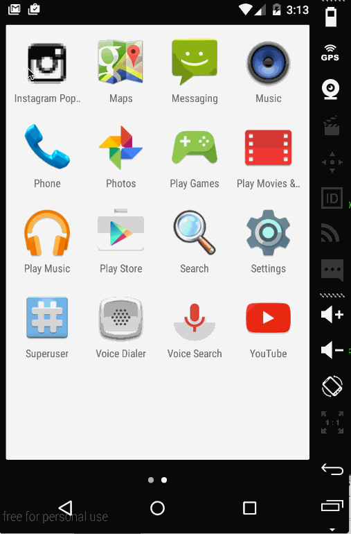

# Instagram Viewer Demo

    This is an Android application for displaying the popular photos using the [Instagram API](https://instagram.com/developer/endpoints/). 

    Time spent: 6 hours spent in total

    Completed user stories:

     * [x] Required: User can scroll through current popular photos from Instagram
     * [x] Required: For each photo displayed user can see Graphic, Caption, Username
     * [x] Optional: For each photo displayed user can see relative timestamp, like count, user profile image
     * [x] Advanced: pull-to-refresh for popular stream with SwipeRefreshLayout
     * [x] Advanced: Display each user profile image using a RoundedImageView

        
       Notes:

       Walkthrough of all user stories:

       

    GIF created with [LiceCap](http://www.cockos.com/licecap/).
